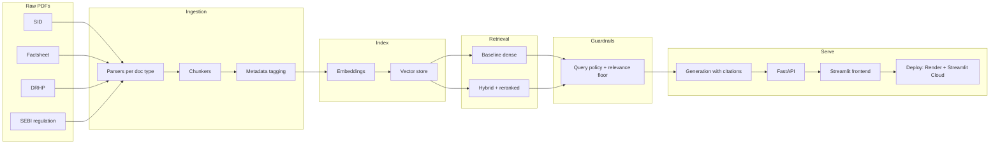

# InvestIQ architecture

## Problem statement

InvestIQ is a retrieval-augmented research assistant over a small, high-signal corpus of Indian capital-market documents: Scheme Information Documents (SIDs), monthly/periodic factsheets, one Draft Red Herring Prospectus (DRHP), and a SEBI regulation text. The product goal is grounded answers with citations—scheme terms, risk factors, portfolio snapshots, IPO disclosures, and regulatory clauses—without treating a single RAG pipeline as “the” system. The project is structured around an evaluation and ablation study because these document types fail in different ways (missed tables, broken clause boundaries, long-context dilution, weak lexical match on legal numbering). Measuring dense retrieval vs hybrid search plus reranking, and reporting those trade-offs on a golden set, is a first-class deliverable, not a post-hoc notebook.

## Data flow

Planned path: drop PDFs under `data/raw/` → type-specific parsers → chunkers → metadata tagging → embeddings → Chroma vector store → retrieval (baseline dense first; hybrid BM25 + dense with rerank in the ablation study) → guardrails (query policy + relevance floor, wrapping whichever retriever is wired) → generation with citations → FastAPI → Streamlit → Render (API) and Streamlit Cloud (UI).

## Document types and why they are treated differently

| Type            | Role in the corpus                                                                 | Why parsing/chunking differs                                                                                                                                                                                                  |
| --------------- | ---------------------------------------------------------------------------------- | ----------------------------------------------------------------------------------------------------------------------------------------------------------------------------------------------------------------------------- |
| SID             | Scheme contract: objectives, investment universe, risks, expenses, load, benchmark | Clause- and section-heavy. Naive page/token splits cut numbered provisions and mix headings with body. Prefer section/clause-aware chunks so a risk or expense answer can cite a stable unit.                                 |
| Factsheet       | Dense periodic snapshot: AUM, allocation, top holdings, ratios, returns            | Tabular and layout-dense. Text extraction that ignores tables loses the facts users ask about. Needs table-aware parsing and chunks that keep a table (or labeled row group) intact rather than wrapping lines as prose.      |
| DRHP            | Long-form IPO narrative: business, risk factors, industry, offer details           | Very long narrative with repeating headings. Fixed small windows fragment arguments; huge windows drown retrieval. Needs heading-aware narrative chunks (risk factor as a unit where possible) so citations stay specific.    |
| SEBI regulation | Clause-numbered legal text                                                         | Legal numbering (`regulation 2(1)(a)`, provisos, explanations) is the retrieval key. Flattening to paragraphs breaks cross-references. Chunk on clause/sub-clause boundaries and keep citation-ready identifiers in metadata. |

## Planned tech stack

| Choice                | Why                                                                                                 |
| --------------------- | --------------------------------------------------------------------------------------------------- |
| FastAPI               | Thin, typed HTTP layer for the research API; easy to test independently of the UI.                  |
| Groq / Llama          | Fast, inexpensive generation for iterative eval loops without hosting a local LLM.                  |
| sentence-transformers | Local, reproducible dense embeddings so index quality is not tied to a paid embed API.              |
| Chroma                | Lightweight persistent vector store that fits a small corpus and local/dev-first workflow.          |
| rank_bm25             | Lexical baseline for hybrid retrieval; strong on clause numbers, scheme names, and legal phrasing.  |
| RAGAS-style metrics   | Faithfulness / context precision / recall / answer relevancy. The `ragas` package currently fails to import (`langchain_community.chat_models.vertexai`); InvestIQ uses Groq-as-judge wrappers in `eval/metrics.py`. DeepEval is the closest packaged alternative. |
| Streamlit             | Fast chat UX for citations and qualitative inspection of retrieval, not a product frontend rewrite. |
| Render                | Host the FastAPI service with a conventional Python deploy path.                                    |
| Streamlit Cloud       | Host the UI separately so API and chat can scale/fail independently.                                |

## Build phases

Living checklist. All items start unchecked.

- [x] **Phase 1 — Ingestion & chunking:** Parse SIDs, factsheets, DRHPs, and SEBI text; chunk and tag metadata; write processed artifacts.
- [x] **Phase 2 — Baseline RAG:** Embeddings, Chroma store, dense retrieval, Groq generation with citations, FastAPI research route.
- [ ] **Phase 3 — Evaluation & ablation study:** Golden-set runner and RAGAS-style metrics exist under `eval/`; full four-config ablation not yet completed (Groq daily quota).
- [x] **Phase 4 — Guardrails:** Query-side refusals, retrieval-floor skip, prompt-injection hardening, disclaimer on every API response; adversarial items scored with a rule-based heuristic.
- [x] **Phase 5 — Chat UX:** Streamlit research chat over `POST /api/research`, citations, disclaimer, corpus sidebar. Decoupled from retrieval config.
- [ ] **Phase 6 — Production hardening:** Config, logging, error handling, tests, and CI that match the real pipeline.
- [ ] **Phase 7 — Deploy & document:** Render + Streamlit Cloud, data-source log, and the full README.

## Disclaimer

InvestIQ is an independent educational project in the retail-investing research domain. It is not affiliated with, endorsed by, or built for any specific AMC, brokerage, or platform. Documents in `data/raw/` are used for research and evaluation only; outputs are not investment advice.